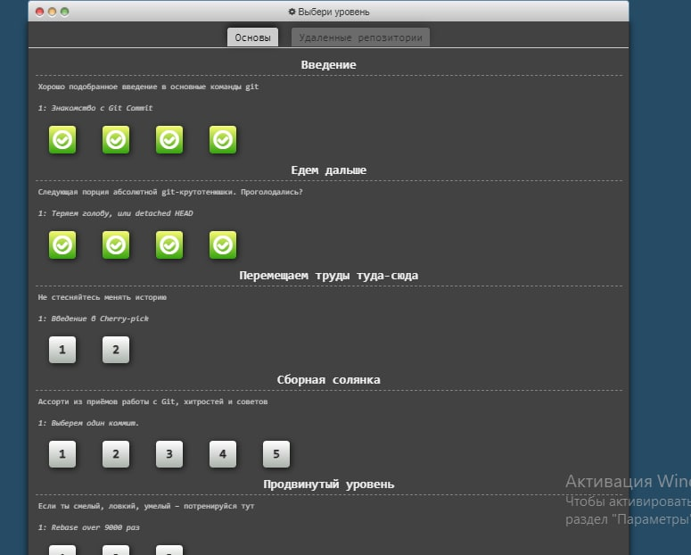
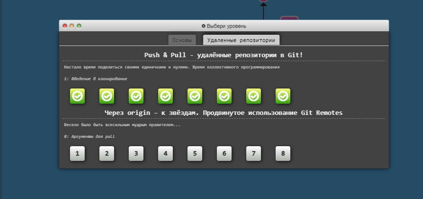
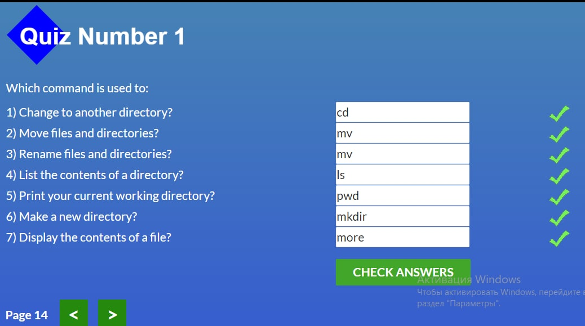
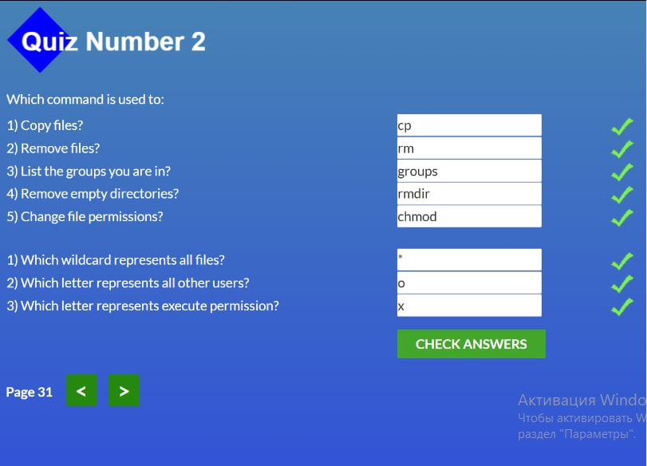
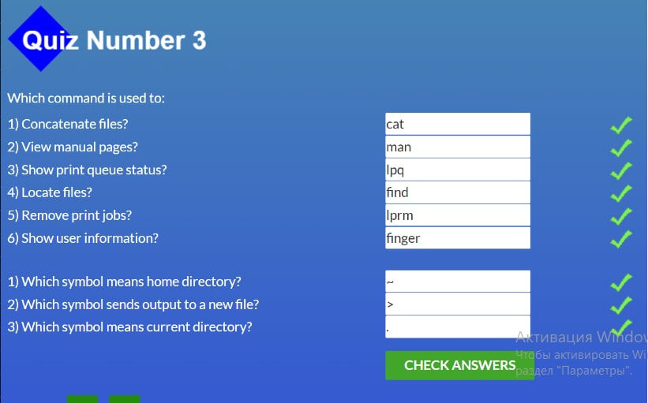
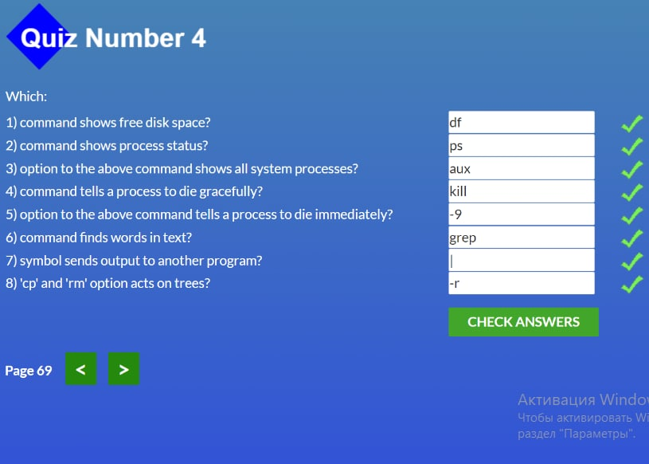

## **Hello. My name Volodymyr. 
### Git Basics
Частину інформації я знав раніше, те що выдноситься до быль базових речей. 
Дуже сподобався сервіс: https://learngitbranching.js.org/?locale=ru_RU. На ньому пройшов основну частину і те, проте пізніше пройду все інше. 

### Сюди я кинув короткий звіт про зроблену роботу на learngitbranching)

  
Srcreenshots

  
  

---

## Linux CLI, and HTTP

Деякі команди мені були знайоми, наприклад такі як в QUIZ 1, але інші команди для мене були не знайоми. Також дуже багато інформації в додаткових посиланнях. З такими речами як протокол, обмін даними між сервером і клієнтом, а також статус відповіді я був знайомий, але більша частина в цих публікаціях мені була не знайома. 

### Також залишу короткий звіт:

  
Srcreenshots

  
  
  
  

1. [HTTP: Протокол, який повинен розуміти кожний веб-розробник - Частина 1](https://code.tutsplus.com/uk/tutorials/http-the-protocol-every-web-developer-must-know-part-1--net-31177)

1. [HTTP: Протокол, який повинен розуміти кожний веб-розробник - Частина 2](https://code.tutsplus.com/uk/tutorials/http-the-protocol-every-web-developer-must-know-part-2--net-31155)

---